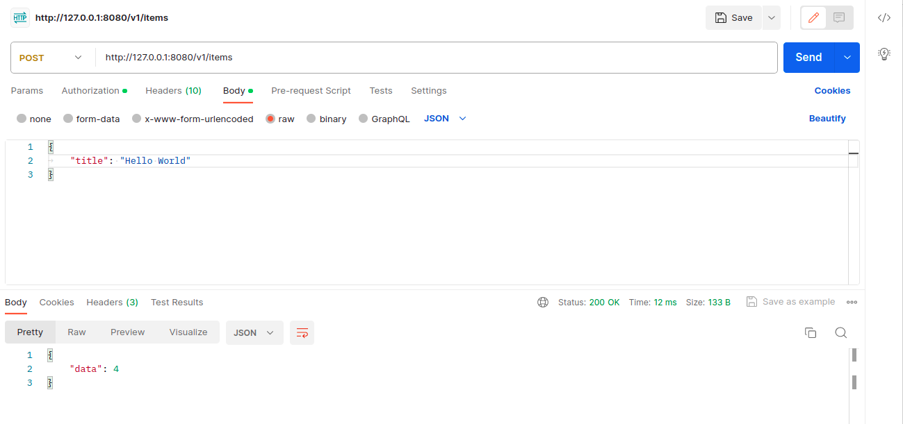
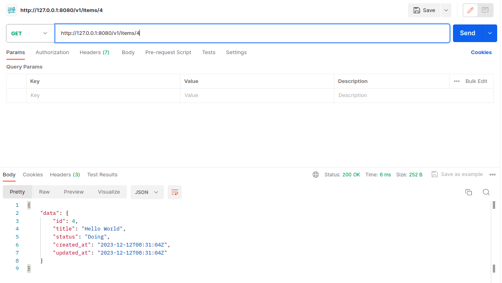
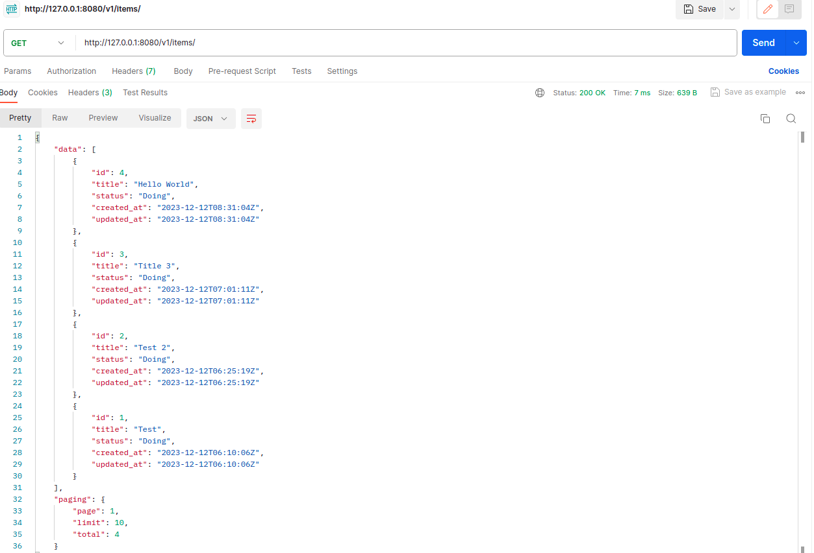
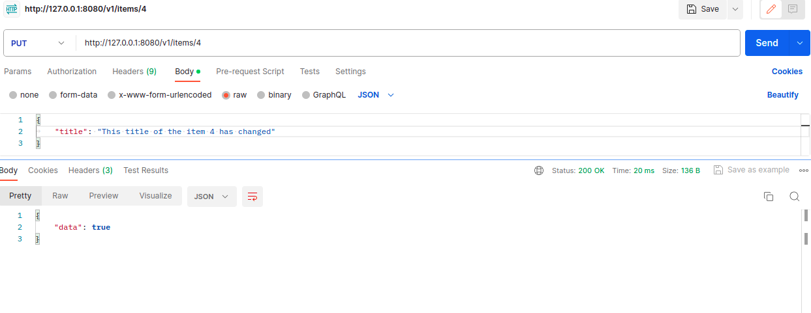
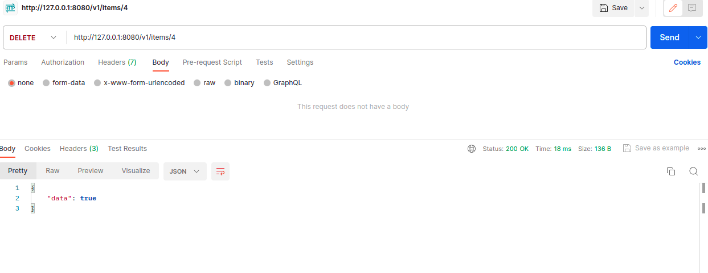

# How to run this project
- Install Golang & MySQL on your local machine.
- Clone this repository
- Use Terminal, change directory to your folder an run command `MYSQL_CONNECTION='YOUR_MYSQL_CONNECTION_STRING' go run main.go`
- If everything is OK. A project is running and listen at port 8080.

# Explain the project

## Business
The provided code for the `create_new_item.go` file belongs to the "Business Rules" layer in the Clean Architecture. Here's a breakdown of the code:

- The `CreateTodoItemStorage` interface defines the contract for the storage component responsible for creating new items. It declares a single method `CreateItem` that takes a context and a `ToDoItem` as input and returns an error.

- The `createBiz` struct represents the business logic for creating a new item. It has a dependency on the `CreateTodoItemStorage` interface.

- The `NewCreateToDoItemBiz` function is a constructor function that creates a new instance of the `createBiz` struct with the provided storage implementation.

- The `CreateNewItem` method is responsible for creating a new item. It first validates the input item using the `Validate` method of the `ToDoItem` model. If the validation fails, it returns the corresponding error.

- Next, it sets the `Status` of the item to a default value ("Doing" in this case). This is an example of applying business rules or logic before persisting the item.

- Finally, it invokes the `CreateItem` method of the storage component to store the newly created item.

The `create_new_item.go` file contains the business logic for creating a new item and relies on the `ToDoItem` model and the `CreateTodoItemStorage` interface. It encapsulates the rules and operations related to creating a new item, making it part of the "Business Rules" layer in the Clean Architecture.

## Storage
#### mysql_storage.go
The provided code for the `mysql_storage.go` file belongs to the "Interface Adapters" layer in the Clean Architecture. Here's a breakdown of the code:

- The `mysqlStorage` struct represents the MySQL storage implementation for the item module. It has a dependency on the `gorm.DB` object, which is the database connection provided by the GORM library.

- The `NewMySQLStorage` function is a constructor function that creates a new instance of the `mysqlStorage` struct with the provided `gorm.DB` object.

The `mysql_storage.go` file contains the implementation of the storage interface for MySQL, making it part of the "Interface Adapters" layer. It is responsible for interacting with the MySQL database using the GORM library.

#### insert_new_item.go
The provided code for the `insert_new_item.go` file belongs to the "Interface Adapters" layer in the Clean Architecture. Here's a breakdown of the code:

- The `CreateItem` method is implemented on the `mysqlStorage` struct, which represents the MySQL storage implementation for the item module.

- This method takes a context and a `ToDoItem` as input and returns an error. It uses the `db` field of the `mysqlStorage` struct, which is a `gorm.DB` object, to create a new record in the database using the `Create` method provided by GORM.

- If the creation operation encounters an error, it returns the error. Otherwise, it returns nil to indicate a successful creation.

The `insert_new_item.go` file contains the implementation of the `CreateItem` method for the MySQL storage, making it part of the "Interface Adapters" layer. It is responsible for persisting a new item in the MySQL database using the GORM library.

## Transport
#### handle_create_new_item.go.go
The provided code for the `handle_create_new_item.go` file belongs to the "Interface Adapters" layer in the Clean Architecture. Here's a breakdown of the code:

- The `HandleCreateItem` function is a handler function that takes a `gorm.DB` object as input and returns a `gin.HandlerFunc`. This function is responsible for handling the creation of a new item through an HTTP request.

- Inside the handler function, it first binds the request data to a `ToDoItem` object using `c.ShouldBind`. If there is an error in the binding process, it returns a JSON response with the error message.

- Next, it preprocesses the title of the item by trimming any leading or trailing spaces.

- It sets up the dependencies required for creating a new item, including creating a new instance of the MySQL storage using the provided `gorm.DB` object and creating a new business logic instance using the storage.

- It then calls the `CreateNewItem` method of the business logic instance, passing the request context and the address of the `ToDoItem` object. If there is an error in creating the new item, it returns a JSON response with the error message.

- Finally, if the creation is successful, it returns a JSON response with the ID of the created item.

The `handle_create_new_item.go` file contains the HTTP request handler for creating a new item, making it part of the "Interface Adapters" layer. It is responsible for parsing the request, preprocessing the data, and calling the appropriate business logic to create a new item.

## main.go
The provided code for the `main.go` file is the entry point of the application and belongs to the "Interface Adapters" layer in the Clean Architecture. Here's a breakdown of the code:

- The `main` function is the entry point of the application.

- It first checks for the presence of the `MYSQL_CONNECTION` environment variable and retrieves the MySQL connection string. If the environment variable is not present, it logs an error message and exits the application.

- It sets up the database connection using the retrieved connection string and the GORM library.

- It creates a new instance of the Gin router.

- It defines a route group `/v1` for versioning and adds different HTTP routes for handling item-related operations, such as creating, listing, finding, updating, and deleting items. Each route is associated with a corresponding handler function from the `todotrpt` package, which is responsible for handling the respective operation.

- Finally, it starts the Gin router and listens for incoming HTTP requests.

The `main.go` file is the entry point of the application and handles setting up the database connection, defining routes, and starting the HTTP server. It acts as the "glue" between the different layers of the Clean Architecture, connecting the "Interface Adapters" layer with the "Business Rules" and "Entities" layers.

# Use Postman to test routes

#### Create a todo item

#### Get a todo item by ID

#### Get all todo items

#### Update a todo item by ID

#### Delete a todo item by ID
